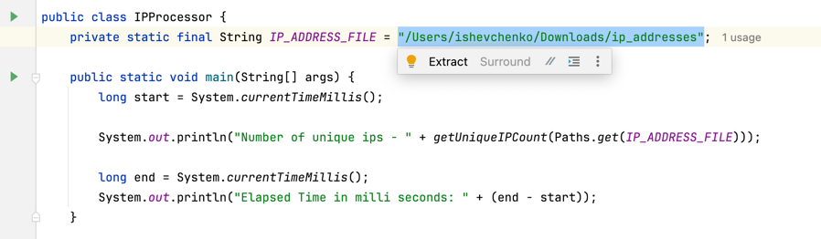
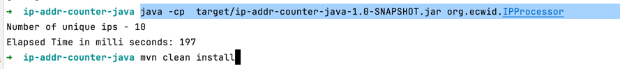

# ecwid
The application is designed to calculate the number of unique ip addresses in the file using as little memory and time as possible.

The file could be unlimited in size and can occupy tens and hundreds of gigabytes.

## Project setup
 - Make sure you have Java 21 or later installed
 - Clone the repository and navigate to the `org.ecwid.IPProcessor#IP_ADDRESS_FILE` where you can specify path to your file with IP addresses 

[](img.png)

 - Run the following commands to build and execute application from the parent directory `ip-addr-counter-java`
```
 mvn clean install 
 java -cp  target/ip-addr-counter-java-1.0-SNAPSHOT.jar org.ecwid.IPProcessor
```

[](img_1.png)

### Run test

- Run the following commands to execute tests
```
 mvn test
```

## Description
The solution reads a text file line by line(instead of loading whole file to the memory) containing IP addresses and efficiently counts the number of unique IPs using a custom BitSet implementation. 

It converts each IP address to its numerical representation using the IPAddressUtil.textToLong() method, which transforms the string representation of an IPv4 address into a 32-bit long. 
The BitSet is then used to track the unique IPs by setting the corresponding bit for each address.

As an output the program logs the total count of unique IP addresses and the time taken to process the file.

## Result
I.e. results from processing of [115GB file](https://ecwid-vgv-storage.s3.eu-central-1.amazonaws.com/ip_addresses.zip) is shown bellow:
```
Number of unique ips - 1000000000
Elapsed Time in milli seconds: 593371
